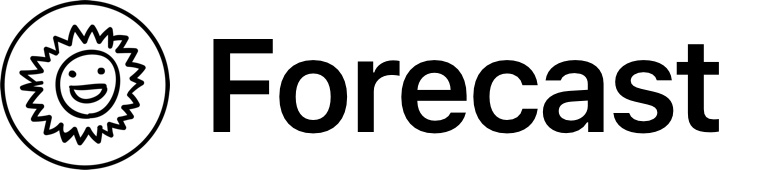

  

## What is it?

Forecast is an app that helps you keep track of the tasks you have coming up. When you add items to your Forecast, it will show you which items are due first, and how long you have left to complete each item. Or, you could use it to count down the days to your next vacation 😉

## How does it work?

When you add an item to your Forecast, you give it a title and a date. Then, Forecast ranks your items by date (earliest first) to try and help you decide what you should work on.

## Demo

_coming soon_

## Where can I get it?

_coming soon_

## Who are you?

I'm [Macguire Rintoul](https://macguire.me). Who are you?

## How do I request a feature?

Feel free to [create an issue](https://github.com/mrintoul/Forecast/issues/new), but I can't make any promises.

## Can I help work on this?

Absolutely. [Create an issue](https://github.com/mrintoul/Forecast/issues/new) with your proposal and let's talk.

## Shout outs

Forecast would not be possible without the hard work of many other people (thanks!). Check out the [dependencies](https://github.com/mrintoul/Forecast/network/dependencies) for some of the packages and tools that helped create Forecast.

## License

Forecast is licensed under a  <a rel="license" href="http://creativecommons.org/licenses/by-nc-sa/4.0/">Creative Commons Attribution-NonCommercial-ShareAlike 4.0 International License</a>. In short, this means you are free to do whatever you want with it, as long as you don't sell it.

## Notes

Thanks to this [Smiling Sun Handmade Symbol SVG Vector](https://www.svgrepo.com/svg/123560/smiling-sun-handmade-symbol) for starring as the logo and app icon of Forecast.
